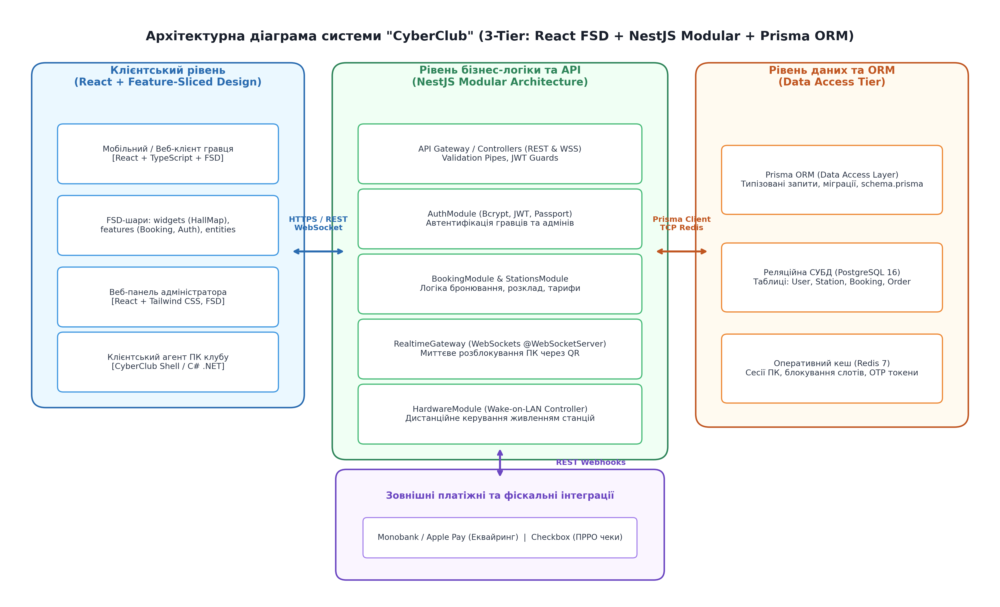
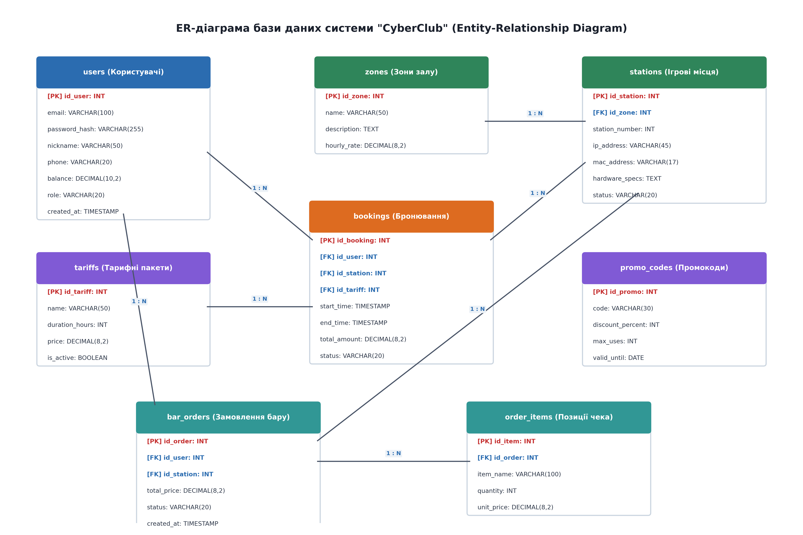
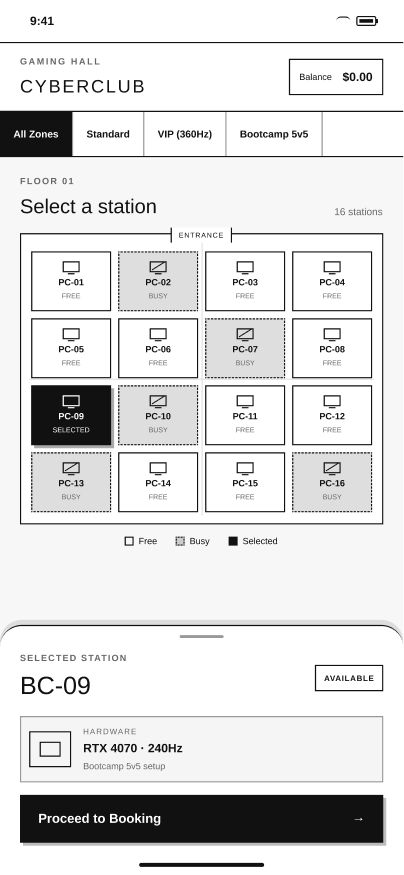
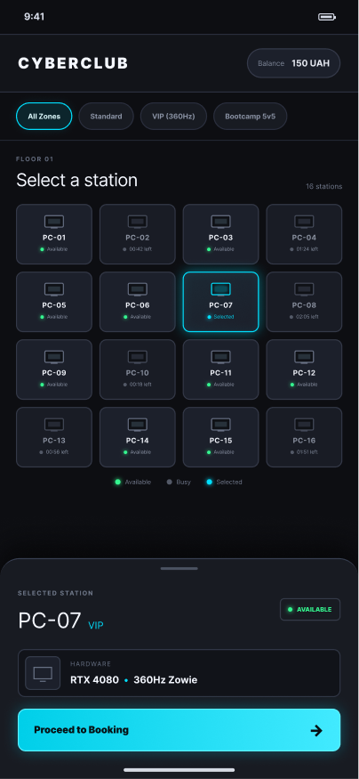

# Документація архітектури та інтерфейсу проєкту CyberClub

У цьому розділі представлена проєктна документація веб-сервісу комп'ютерного клубу CyberClub, розроблена в межах лабораторної роботи номер 3. Документація охоплює архітектурне рішення системи, реляційну модель даних (ERD), а також прототипи користувацького інтерфейсу (Wireframe та Mockup).

### Архітектура системи (Architecture Diagram)

Для веб-сервісу комп'ютерного клубу CyberClub обрано модульну трирівневу клієнт-серверну архітектуру. Клієнтська частина базується на React з підходом Feature-Sliced Design (FSD), що забезпечує чітке розмежування відповідальності компонентів інтерфейсу. Серверний бекенд реалізовано на базі фреймворку NestJS з розбиттям на ізольовані доменні модулі (Auth, Booking, PC, Payment, Review) та взаємодією з СУБД PostgreSQL через ORM Prisma. Зовнішні інтеграції включають платіжний шлюз для безпечної обробки транзакцій та поштовий сервіс для автоматичної відправки сповіщень.

### Діаграма "сутність-зв'язок" (ER Diagram)

Реляційна модель даних спроєктована для забезпечення цілісності та узгодженості інформації про бронювання, користувачів і обладнання. Модель включає ключові сутності: User (з ролями клієнта, адміністратора та техніка), PC, Zone, Booking, Payment, Review та Session. Зв'язки між сутностями підтримують каскадні правила та обмеження унікальності, що запобігає овербукінгу робочих місць на однаковий часовий інтервал. Використання PostgreSQL разом з індексами за полями статусу та часу гарантує високу швидкість виконання запитів пошуку доступних ПК.

### Вайрфрейм вибору місця (Wireframe)

Вайрфрейм демонструє низькодеталізовану структуру екрана інтерактивної карти комп'ютерного клубу та процесу бронювання робочого місця. На макеті чітко розмежовано зону фільтрів (за категорією залу: Standard, VIP, Bootcamp), графічну сітку розташування комп'ютерів та панель швидкого бронювання з вибором тривалості сесії. Інформаційна архітектура орієнтована на мінімізацію кількості кроків користувача: вибір ПК, часовий слот та підтвердження здійснюються на одному екрані без зайвих дій.

### Фінальний мокап інтерфейсу (Mockup)

Високодеталізований мокап відображає кінцевий графічний дизайн інтерфейсу бронювання у сучасній темній стилістиці (Cyberpunk Dark UI) з акцентними неоновими елементами. Стан кожного комп'ютерного місця візуалізується інтуїтивно зрозумілими кольоровими індикаторами: зелений для вільних ПК, помаранчевий для зайнятих та блакитний для вибраного користувачем місця. Бокова панель містить детальні характеристики обраного комп'ютера (процесор, відеокарта, монітор), розрахунок підсумкової вартості та кнопку переходу до миттєвої онлайн-оплати.

